**GoREST API Testing & Automation with Postman**

**Names**: INGABIRE Marie Noelle

**Module**: Web Infrastructure\_ Formative Assignment

**API Used**: GoREST - Public REST API with Bearer Token Authentication

**Base URL**: https://gorest.co.in/public/v2

**Github Repository**:
https://github.com/Noelle-1220/API_Testing_Formative

**1.API Choice**

To carry out this assignment , I used GoREST as it is the best API
because it is free, supports full CRUD(Create, Read, Update and Delete)
and also uses a simpler Bearer Token instead of a complex OAuth2 flow.

GoREST uses a personal access token model unlike other API, GoREST
allows a user to log in with a username/password and get a static token
(generated at
[<u>gorest.co.in/public/v2</u>](http://gorest.co.in/public/v2) ) tied to
the account (either Github or Google). The token acts as your
authorization proof to carry out requests like GET, POST, PUT/PATCH and
DELETE.

**2. GoREST API Endpoint Documentation**

<table style="width:97%;">
<colgroup>
<col style="width: 17%" />
<col style="width: 13%" />
<col style="width: 26%" />
<col style="width: 19%" />
<col style="width: 19%" />
</colgroup>
<tbody>
<tr>
<td>Purpose</td>
<td>Method</td>
<td>Endpoint</td>
<td>Auth Required?</td>
<td>Request Body</td>
</tr>
<tr>
<td>List all users</td>
<td>GET</td>
<td>{{base_url}}/users</td>
<td>None (Public read)</td>
<td>None</td>
</tr>
<tr>
<td>Get one user</td>
<td>GET</td>
<td>
{{base_url}}/User/

[{user_id}}
</td>
<td>None (public read)</td>
<td>None</td>
</tr>
<tr>
<td>Create user</td>
<td>POST</td>
<td>{{base_url}}/users</td>
<td><strong>Authorization</strong>: Bearer {{auth_token}}
<strong>Content-Type</strong>: application/json</td>
<td><strong>JSON</strong>: name, email, gender, status</td>
</tr>
<tr>
<td>Update user</td>
<td>PUT/PATCH</td>
<td>{{base_url}}/users/{{user_id}}</td>
<td><strong>Authorization</strong>: Bearer {{auth_token}},
<strong>Content-Type</strong>: application/json</td>
<td>JSON with fields to update</td>
</tr>
<tr>
<td>Delete user</td>
<td>DELETE</td>
<td>{{base_url}}/users/{{user_id}}</td>
<td><strong>Authorization</strong>: Bearer {{auth_token}}</td>
<td>None</td>
</tr>
</tbody>
</table>

**3. Authentication Process**

**Method Used**: Bearer Token (GoREST Personal Access Token)

The token generated was added in the GoREST Env (a Postman Environment)
as auth_token. At the collection/folder level,I set the Authorization
tab to Bear Token using {{auth_token}} as the token value. Setting it at
the Collection level allows every request inside the folder to
automatically inherit the exact authentication without repeating it per
each request I make.

This way of authentication satisfies the underlying goal as a
login-based pre-request script, but abides by GoREST’s actual token
model rather than simulating a login flow.

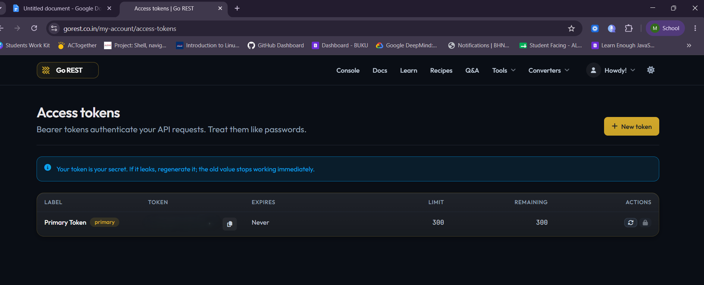

**4.Postman Environment & Variables**

**GoREST Env** is a postman environment created to contain following
variables**:**

|  |  |
|:---|:---|
| **Variable** | **Purpose** |
| **base_url** | Stores the API’s base url, making variable reuse easier since it’s updated in one place. |
| **auth_token** | Stores the Bearer Token used to authenticate write operations. |
| **user_id** | Initially left empty then populated after the user is created (POST) and reused across the remaining CRUD operations. |

All requests reference these variables using postman’s {{variable_name}}
syntax. Using this method allows us to only update changes in the
environment instead of updating each request individually.

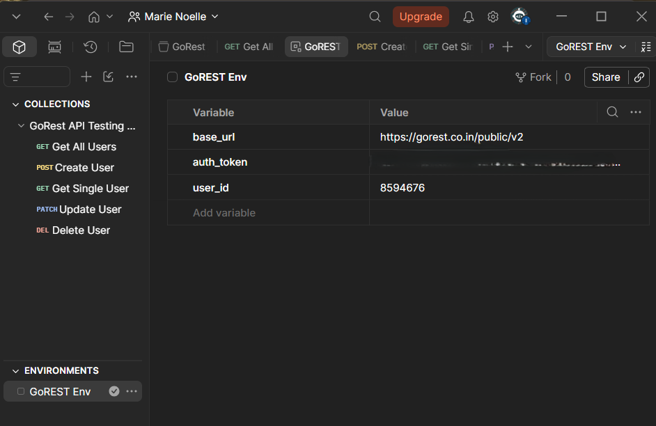

**5. CRUD Operation \_ Explanation and Screenshots**

1.  **Get all User:**

- Request: GET {{base_url}}/users retrieves all users that used the
  GoREST API. I carried out this step to ensure the environment and
  auth_token are functioning properly

- Response: the request returned a 200 status indicating all were in
  place and green flagged. The result listed all users as I requested.

- Screenshot:

> 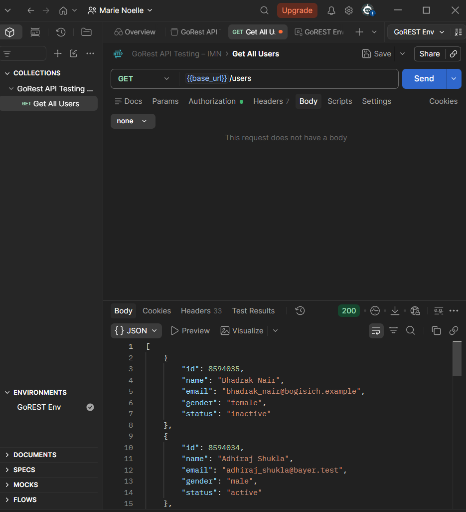

2.  **POST - Creating my user**

- Request: POST {{base_url}}/users

- Body:

> {
>
> "name": "YOUR_NAME_HERE",
>
> "gender": "male",
>
> "email": "YOUR_EMAIL_HERE\_{{\$randomInt}}@example.com",
>
> "status": "active"
>
> }

- Response: a 201 indicating the user was created successfully. The
  result comes bearing an Id which will be considered a unique user id
  and the value for variable {user_id} . “{\$randomInt}}” is a Postman
  dynamic variable that ensures there is not similar email which keeps
  my email accepted by GoREST.

- Post-response script:

> 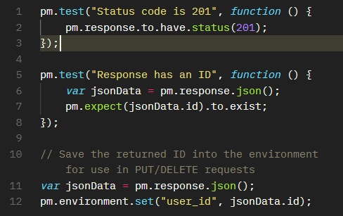 style="width:5.76563in;height:2.41667in" />

- Screenshot:

> 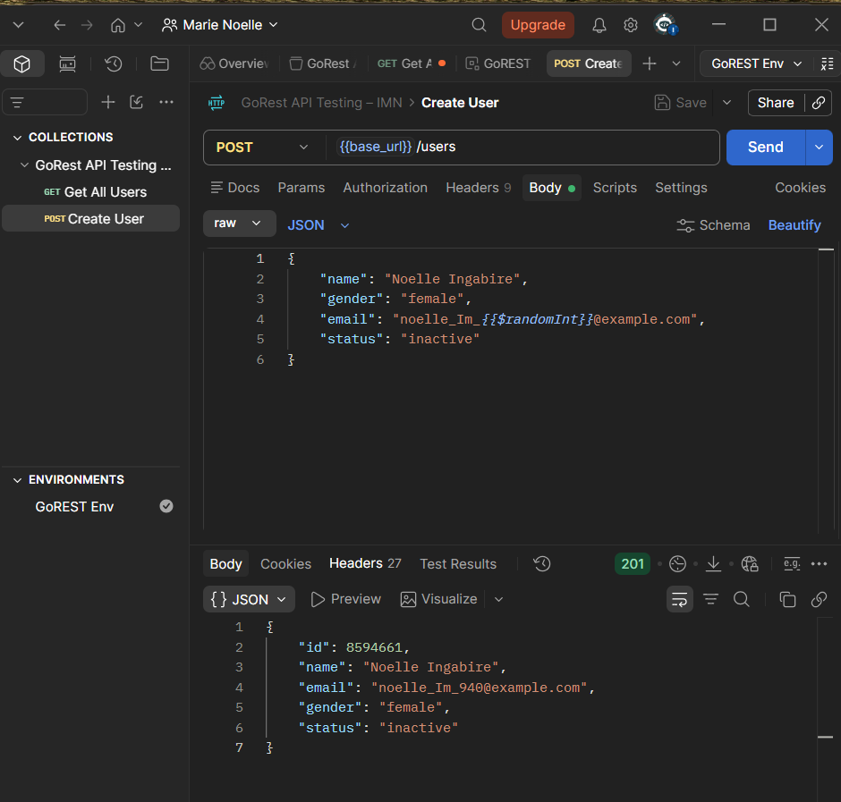 style="width:6.26772in;height:4.52778in" />

3.  **Get Single User**

- Request: {{base_url}}/users/{{user_id}}

- Script:

> 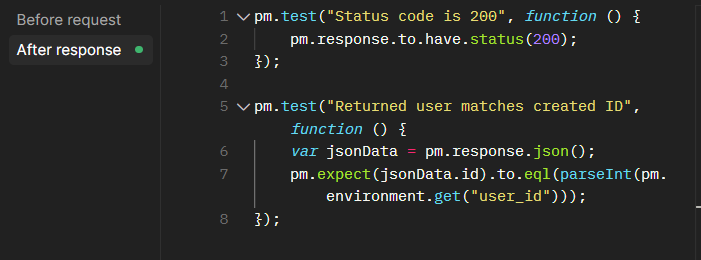 style="width:6.26772in;height:2.31944in" />

- Response: a 200 indicating the request was successful. Reference to
  the image below.

- Screenshot:

> 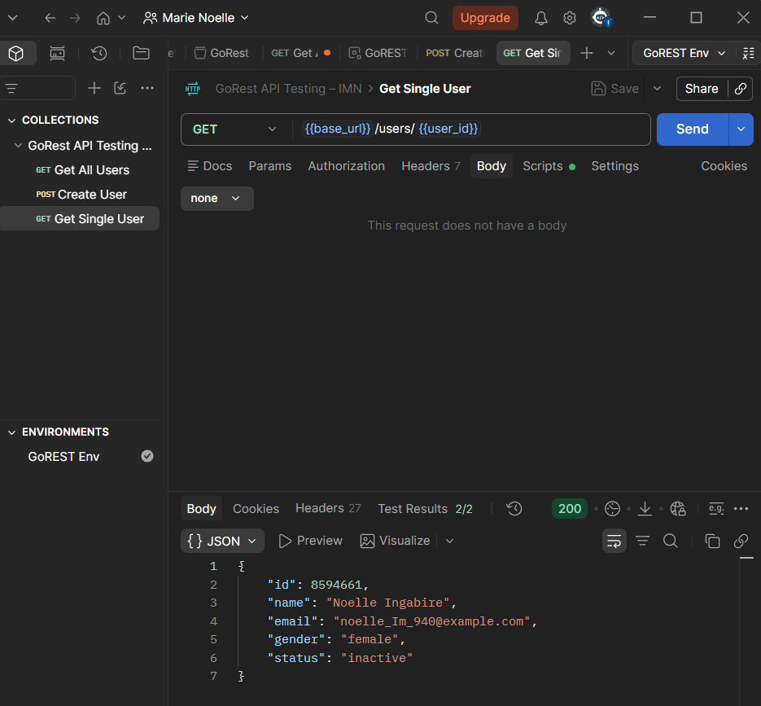 style="width:6.26772in;height:4.86111in" />

4.  **PUT/PATCH - Update the user**

- Request:PATCH {{base_url}}/users/{{user_id}} , I used PATCH to only
  update and inside specific areas of my request instead of PUT as I
  would have to write all the body details even those I do not intend to
  change.

- Body:

> raw=\>JSON
>
> 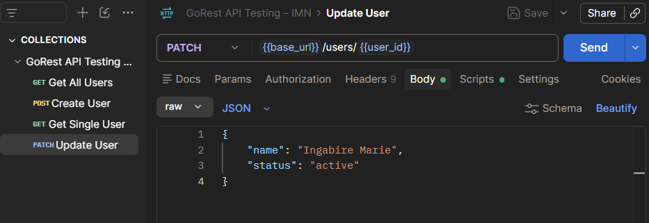 style="width:6.26772in;height:2.15278in" />

- Script:

> 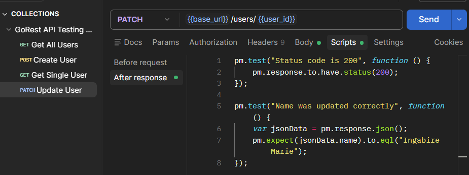 style="width:6.26772in;height:2.34722in" />

- Response: a 200 indicating it was successful. More details reference
  to the below image.

- Screenshot:

> 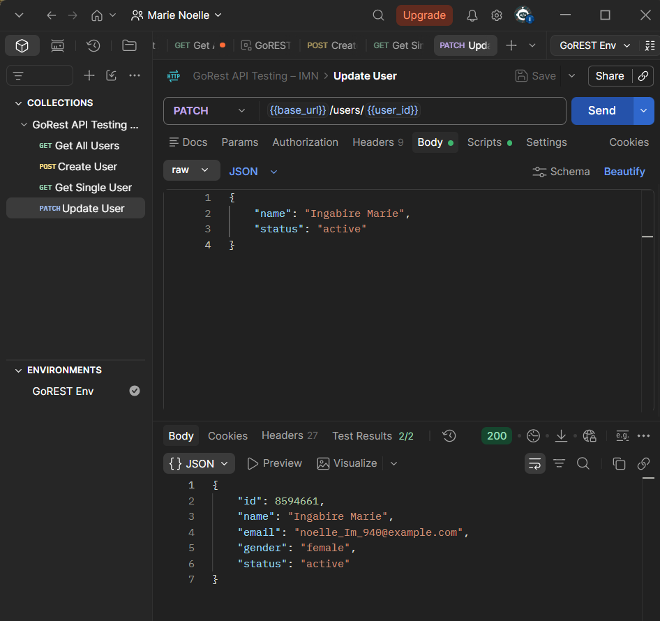 style="width:6.26772in;height:4.91667in" />

5.  **DELETE - Remove the User**

- Request: DELETE {{base_url}}/users/{{user_id}}

- Script:

> 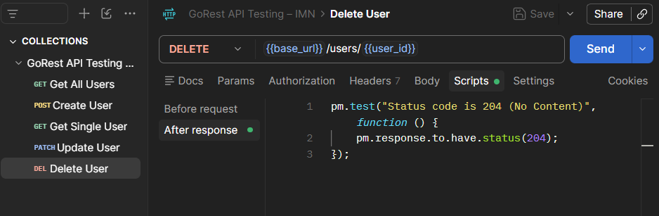 style="width:6.26772in;height:2.05556in" />

- Response: a 204 code meaning No Content which indicates the deletion
  was a success, more details reference to the image below.

- Screenshot:

> 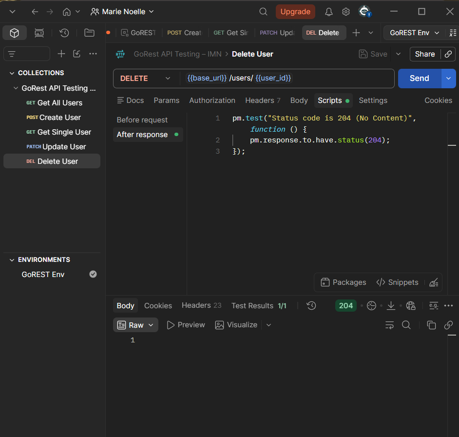 style="width:6.26772in;height:5.95833in" />

**6. Successful Collection Runner**

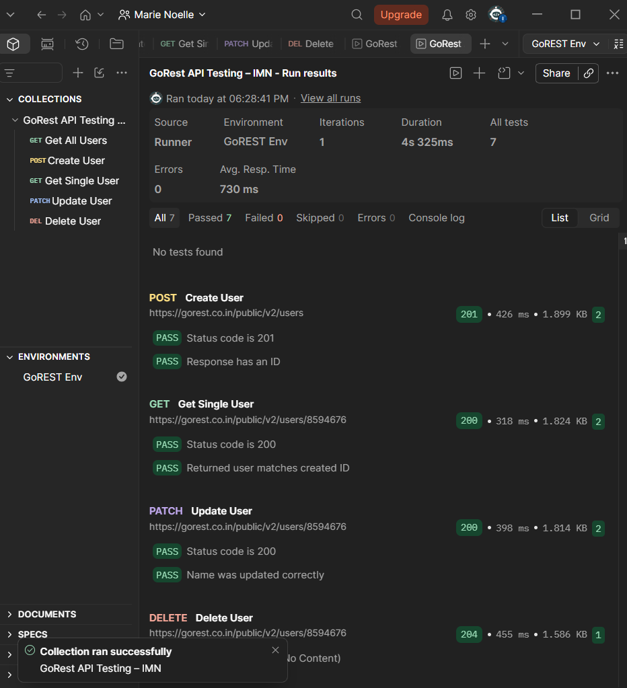

**7. Deliverable Included in this Repository**

- GoREST API Testing - IMN_collection.JSON

- GoREST Env_environment.JSON

- Media Folder (containing screenshot used in this report as image 1-13)
